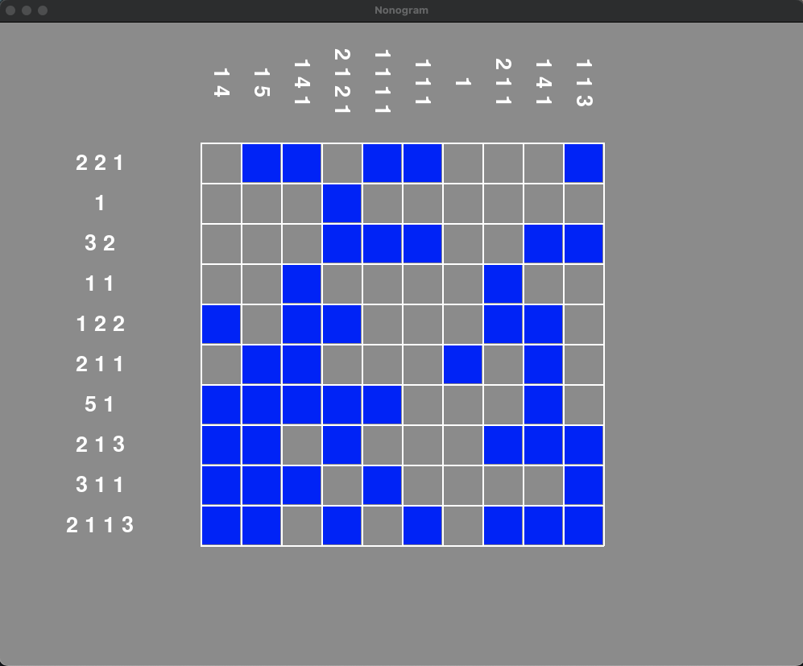

# 🧩 Nonogram

Nonogram is a puzzle game in which players fill in cells on a grid to reveal a hidden image based on numerical clues
given for each row and column

This is first project, and I completed it the summer after my freshmen year at CUNY Hunter College. I began completing Nonograms on my phone, started to really enjoy the game and thought it would be cool to create a program that generates Nonogram game boards. I decided to use python for the implementation, specifically, pygame and numpy.

The program uses a 2D array to generate a 10x10 grid, resembling a solved Nonogram board. Later, I decided to add threading to speed up the array parsing process

<figure style="text-align: center">
    

</figure>

## Getting Started

Clone down this repository. You will need `Python` and `Git` installed globally on your machine.

## 🛠 Installation and Setup Instructions

1. Travel to root directory

2. Create virtual enviorment: `python -m venv <env_name>`

3. Avtivate enviorment: `source <env_name>/bin/activate`

4. Install packages: `pip install -r requirements.txt`

5. Run the project with: `python Nonogram.py`

6. When done, run: `deactivate`

## Threading

- I left a sample file (threadSample.py) for Threading in Python, incase you're unfamiliar with the implementation
- [Here](https://www.w3schools.in/python/multithreaded-programming) is a resource to understand threading

### Thank You For Visiting `!!!`
